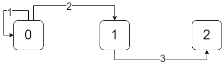

## Máquina de Estados Finitos no Matlab

Autor: André Rangel

Data: 27/06/23

Este projeto implementa uma máquina de estados finita e genérica em Matlab para ser usada tanto em linha de comando do Matlab, scripts ou em modelos para Simulink. Em comparação com projetos como StateFlow, essa implementação apresenta uma interface simples em código ao invés de diagramas de blocos. Um dos objetivos é empregar essa aplicação para:

- Desenvolver máquinas de estados com muitos elementos, o que pode ser trabalhoso se transportado para um diagrama de blocos no Simulink; 

- Aplicações no simulink em que é necessário uma máquina de estados apartir de dados gerados por outros programas. 

### O modelo
A representação da máquina de estados é dada através de 2 entidades: o estado e a máquina de estados. O estado (src/model/State.m) pode ser definido por:
- number: número dado pelo usuário aos estados;
- name: nome do estado;
- activeEvents: vetor booleano para definir quais estados estão ativos e inativos na máquina.

A máquina de estados (src/model/StateMachine.m) pode ser definida por:
- eventsArray: vetor (nx1) que contém o número total de eventos;
- transitions: matriz (nx3) de transição: contém todas as possíveis transições entre os estados através de eventos.
- numberOfStates: número total de estados dentro da máquina de estados.
- statesArray: cell array (nx1) com os estados (State).
- stateNumber: número do estado atual da máquina;
- stateIndex: índice do statesArray.

### Como criar uma máquina de estados simples
Neste exemplo, vamos criar uma máquina de estados finitos com 3 estados que executa as seguintes mudanças:

Primeiro, copie o conteúdo em src/model/ para um arquivo qualquer, como: 
~~~ 
statemachine/model/.
~~~
Crie um script no diretório raíz e adicione o caminho da pasta copiada ao 'path' do Matlab. 

~~~
addpath statemachine/model
~~~

Criar uma máquina de estados a partir dos objetos da classe State:
~~~
s0 = State(0, 's0', [1, 1, 0, 0]);
s1 = State(1, 's1', [1, 0, 0, 0]);
s2 = State(2, 's2', [1, 1, 1, 0]);

eventsArray = [1, 2, 3, 4];
~~~

Os argumentos representam o número, nome e eventos ativos para cada estado. O vetor eventsArray representa o número que corresponde a cada evento. Assim, para o estado s0, o evento 1 e 2 são ativos, enquanto os eventos 3 e 4 não.

A máquina de estados pode ser criado por:
~~~
transitions = [0, 1, 0; 0, 2, 1; 1, 3, 2];
stateMachine = StateMachine({s0, s1, s2}, transitions, eventsArray);
~~~
A máquina de estados precisa dos argumentos: 
- Um cell array contendo todos os estados;
- A matriz (nx3) com todas as transições possíveis. Uma por linha. 
- Vetor com os números dos eventos.

Para verificar qual o estado:

~~~
state = stateMachine.currentState;
disp(state)
~~~

O prompt deve exibir:
 ~~~
  State with properties:

          number: 0
            name: 's0'
    activeEvents: [1 1 0 0]
 ~~~

Que significa um objeto da classe State com número 0. O número pode ser exibido com:

~~~
disp(s.number)
~~~

Se o evento 2 for atribuído a máquina:
~~~
stateMachine.inputEvent = 2;
s = stateMachine.currentState;
disp(s)
~~~

O seu estado será mudado para 1.
~~~
 State with properties:

          number: 1
            name: 's1'
    activeEvents: [1 0 0 0]
~~~

De acordo com a segunda linha da matrix 'transitions'.
